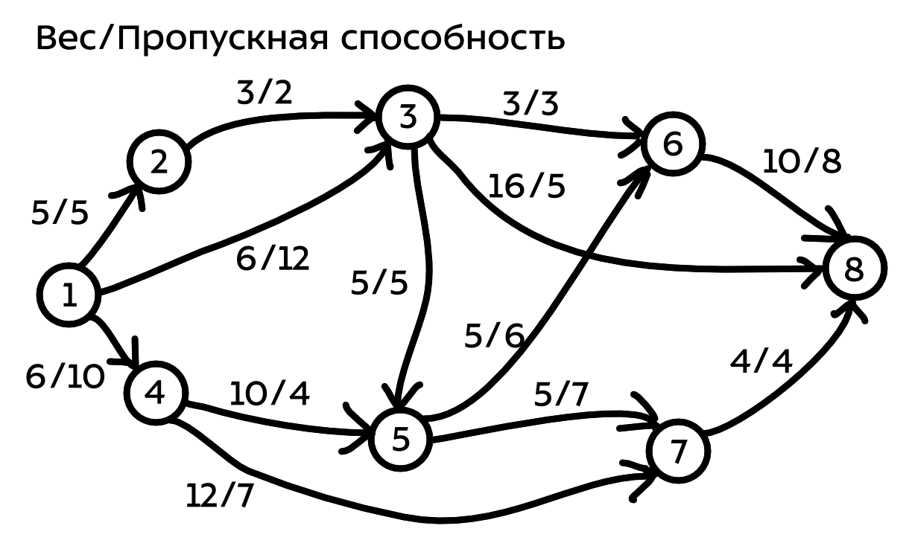

# :books: Моделирование операций, Задание №3.1

## :mortar_board: Формулировка задания

Для реализации алгоритмов определения потока минимальной стоимости (алгоритм Басакера–Гоуэна и Алгоритм Клейна) надо взять произвольный граф из 7-10 вершин (можете найти в просторах Интернета или придумать сами)

Я придумал вот такой граф

## :ocean: Материалы

 - Исследование операций. глава 1 часть 2. Смотрел только это. Прикреплено здесь в файлах. Начало на 30-ой странице в документе

## :bookmark: Примечание

- Решение должно быть универсальным, требуется только не превышать пропускную способность. Если нет - подгоняйте граф. Но мой взятый из башки граф выше работает как часы